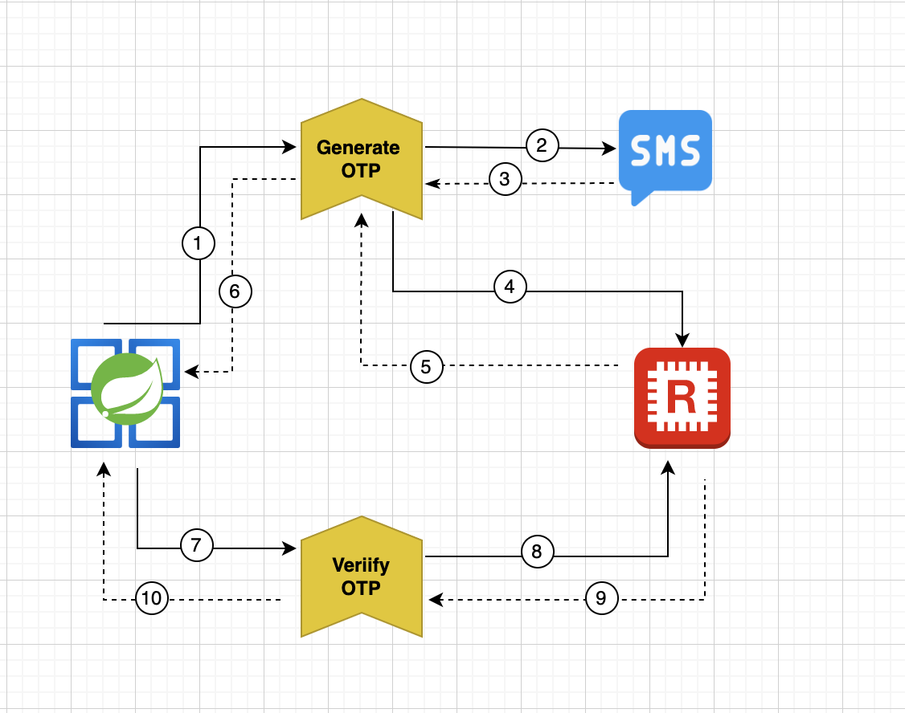

# Springboot - OTP-Service
##### Using [Redis](https://redis.io/download/) & [Fast2SMS](https://www.fast2sms.com/) 



### Working Process

- Client calls **generateOTP endpoint** and passing the mobile number as payload. The otp service will internally calls the 3rd party sms provider and sends the OTP code to client's mobile number.
- Once, the OTP code is sent. It will upset the otp code & mobile number to redis and sending OTP_id as a response to the client
- Client calls the **verifyOTP endpoint** and passing OTP code and OTP_id in the payload.
- Passing the OTP_id as a key and fetch the data from redis.
- Validate the client's otp code & redis stored otp code.
- Send response to client 

### Prerequisite

- Install Redis DB server
- Install RedisInsight - Redis GUI to check the added record
- [Fast2SMS](https://www.fast2sms.com/) - Need AUTH token from this vendor for sending OTP.
- Create a **.envfile** and add these key/value 
```
   FAST_SMS_AUTH = <FAST2SMS_AUTHTOKEN>
   REDIS_USER_NAME = <REDIS USER NAME>
   REDIS_PASSWORD = <REDIS PASSWORD>
```

### Installation

Clone this project and do maven clean install.

### Swagger UI

Run the app from your IDE and open the below url in your browser
```sh
http://127.0.0.1:8080/swagger-ui/#
```

> Note: pass `client=demo-app` in request header.

